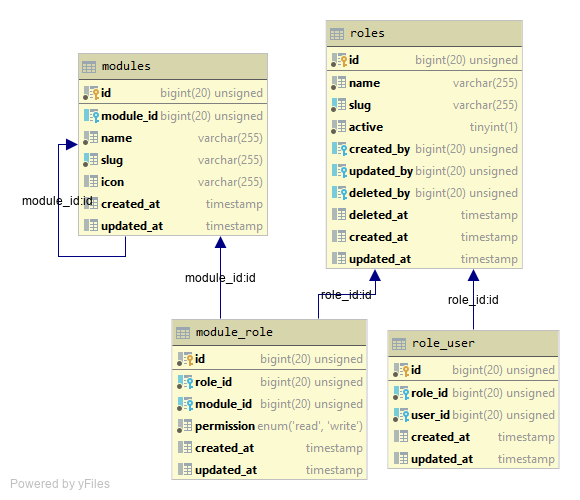

# Configuration

## Database

Lararole provides role management db structure. Your application must migrate it before use it.

### ER Diagram



### Migrations

- 2019_11_17_000000_create_modules_table
- 2019_11_17_100000_create_roles_table
- 2019_11_17_200000_create_module_role_table
- 2019_11_17_300000_create_role_user_table

To migrate these migrations.
    
    php artisan migrate

## Seeder

For development generate dummy roles with some modules.
Call LararoleSeeder in `DatabaseSeeder.php` class.

```php
$this->call(\Lararole\Database\Seeds\LararoleSeeder::class);
```

After seeder setup run

    php artisan db:seed

## Super Admin Role

To create a super admin role which has every module write access.

    php artisan make:super-admin-role

## Make Views

To generate basic blade views with exact directory path run

    php artisan make:views

All the views will generate in specific folders with sequence of module and nested modules like this.

## Views Directory Structure

```
modules
│
└───Module
│   │
│   └───Child Module
│       │   create.blade.php
│       │   edit.blade.php
│       │   index.blade.php
│       │   show.blade.php
│
└───Module
│   │
│   └───Child Module
│   │    │
│   │    └───Child Module
│   │        │   create.blade.php
│   │        │   edit.blade.php
│   │        │   index.blade.php
│   │        │   show.blade.php
│   │
│   └───Child Module
│       │   create.blade.php
│       │   edit.blade.php
│       │   index.blade.php
│       │   show.blade.php
│
└───Module
│   │   create.blade.php
│   │   edit.blade.php
│   │   index.blade.php
│   │   show.blade.php
```

## Routes

There are default 4 routes 
- `module.index` to show index page.
- `module.create` to show create page.
- `module.show` to show show page.
- `module.edit` to show edit page.

```php
Route::get('module/{module_slug}', 'Controller@index')->name('module.index');
Route::get('module/{module_slug}/create', 'Controller@create')->name('module.create');
Route::get('module/{module_slug}/{module}', 'Controller@show')->name('module.show');
Route::get('module/{module_slug}/{module}/edit', 'Controller@edit')->name('module.edit');
```

### How to use routes?

```php
route('module.index', $module->slug);
route('module.create', $module->slug);
route('module.show', [$module->slug, $product->id]); // Here product is object of Product model. you have to send product id to this route. 
route('module.edit', [$module->slug, $product->id]); // same here, id required of Any Model
```

#### How to use id

In views folder `show.blade.php` or `edit.blade.php` controller will return back that `id` back.

##### Example of use id in blade

```blade
@section('content')
@php
    $object = YourModel::find($id);
@endphp

{{--Example of use in edit.blade.php--}}
<input type="text" name="name" value="{{ old('name') ?? $object->name }}">
@endsection
```
